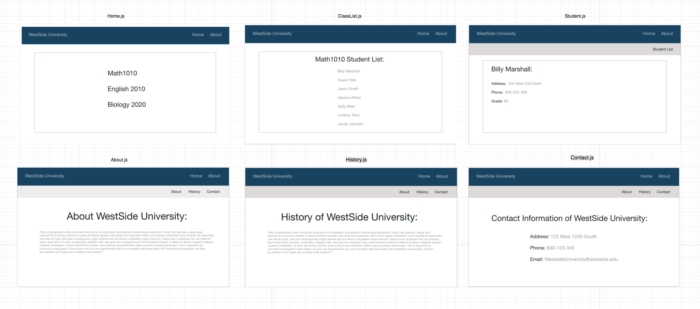
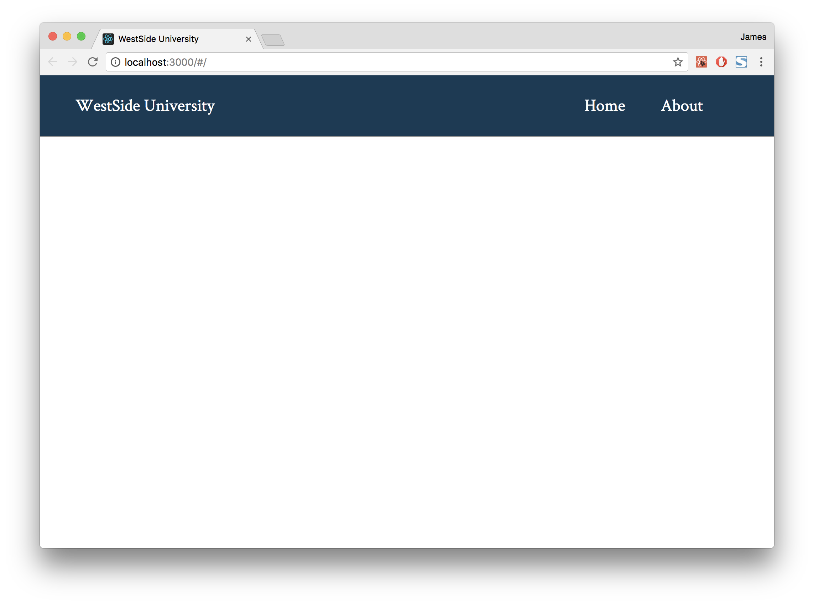
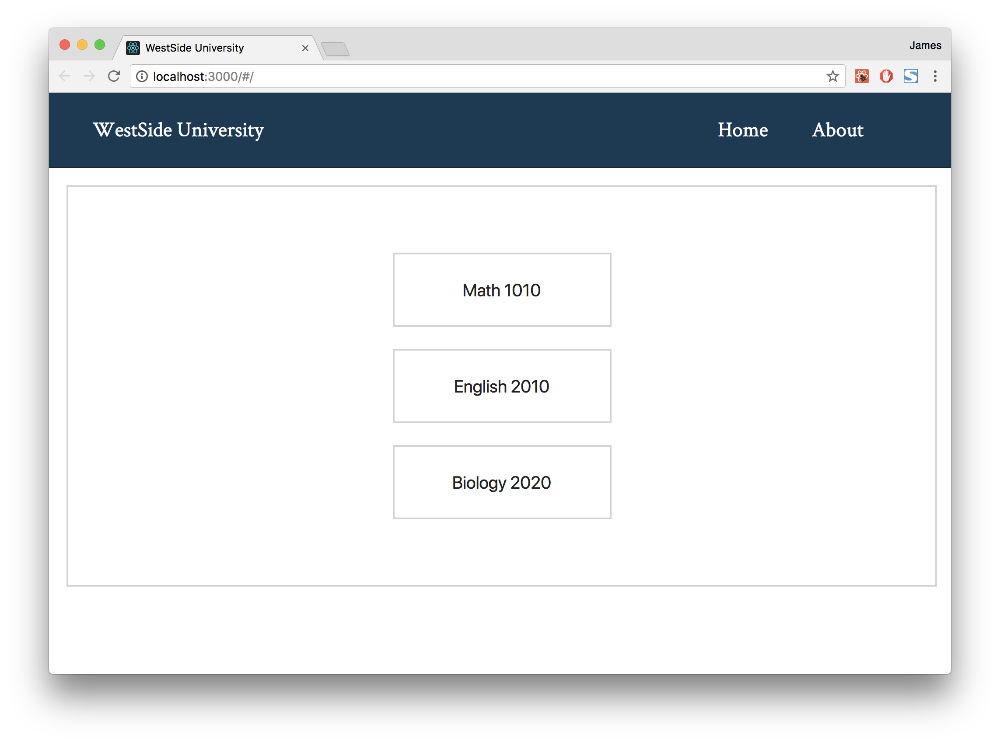
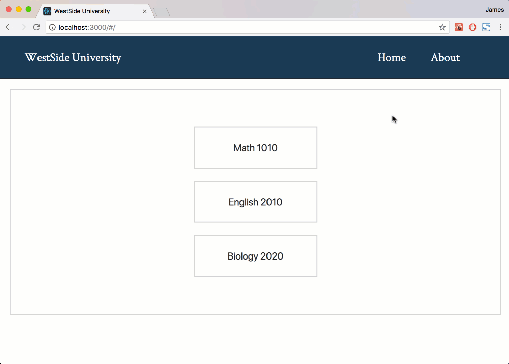
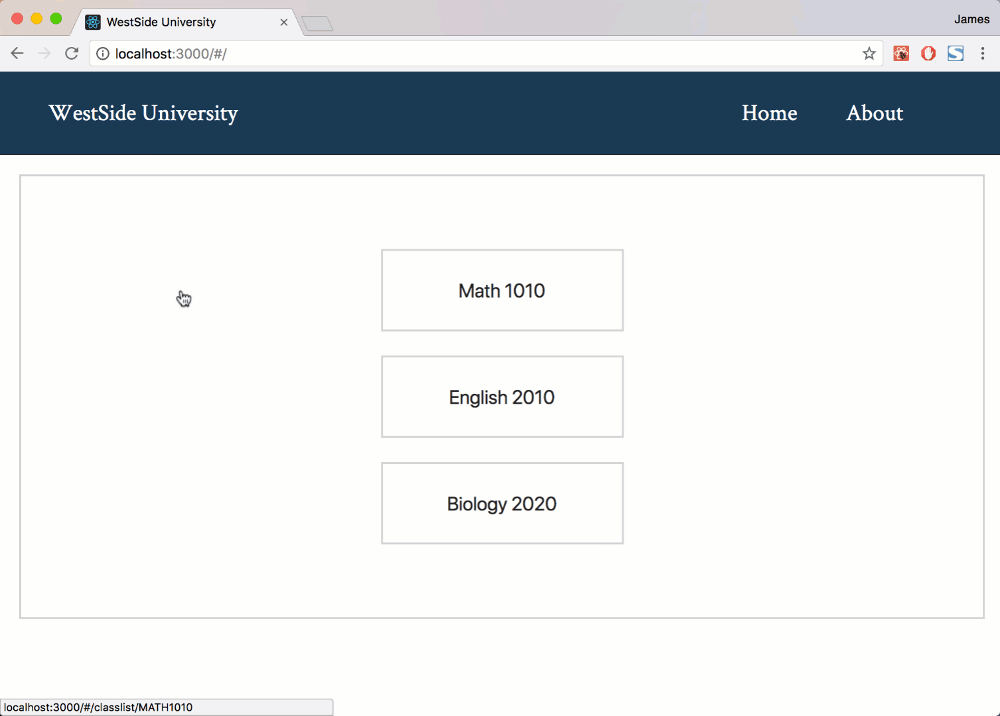
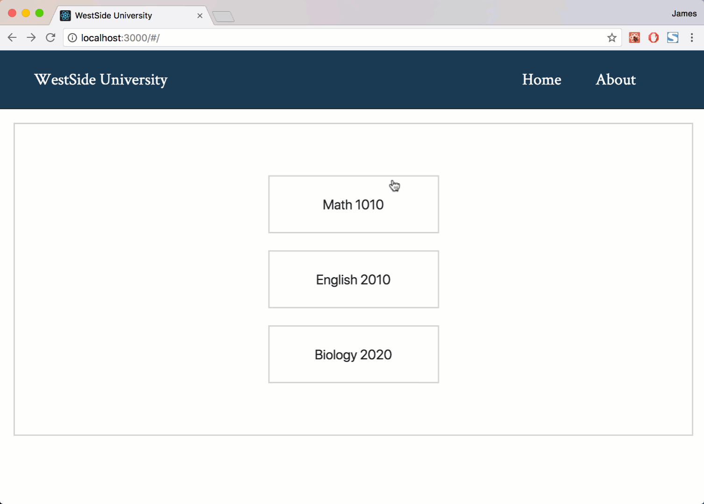
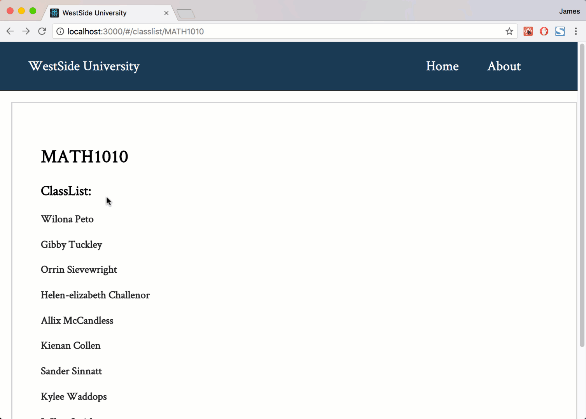
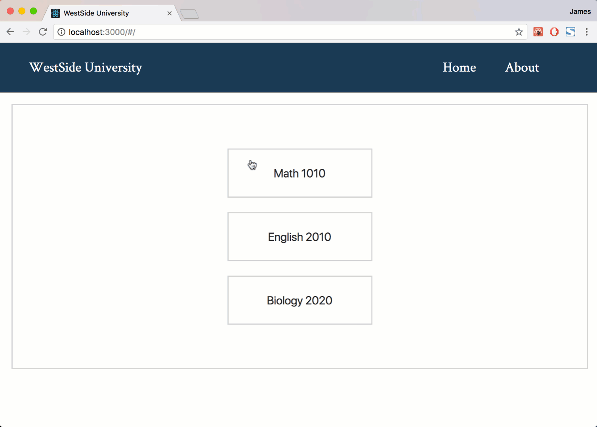
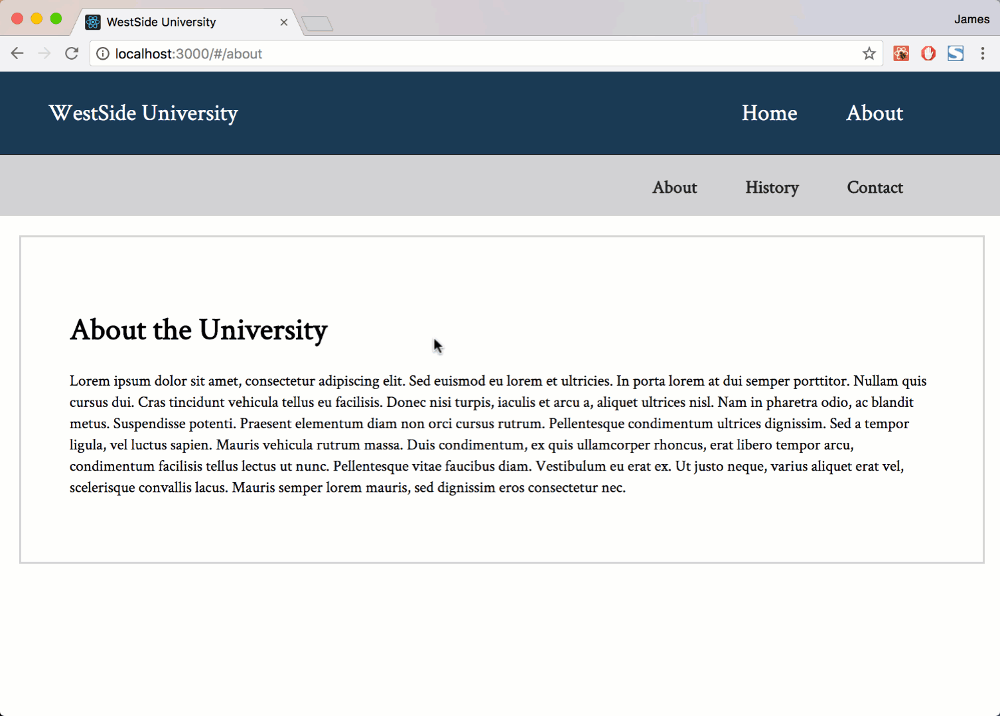

# Website University

## Context

In this project we will be building a site for a University to keep track of student information and class enrollment. We will be using React Router to navigate between the various views. Take some time to familiarize yourself with the provided structure.

+ `App` will be the top level component for our application.
+ `Home` will be the home page displayed when the application first loads. It will also display the available classes.
+ `About` will be the about page displaying information about the University.
+ `History` will be a nested view with the about page and will display the history of the university.
+ `Contact` will be a nested view with the about page and will display the University's contact information.
+ `ClassList` will display all the enrolled students for that specific class.
+ `Student` will be the detail view for a particular student.

## Sketches



## Setup Instructions

In Terminal:

```sh
# (1) Create the project
$ create-react-app university-website

# (2) Go inside the directory created
$ cd university-website

# (3) Run the application
npm start

```

### Notes

You will need to use a fake server. Try to do it with `json-server`.

**This library will mimic a REST api and allow you to make HTTP requests for the student data.**

All data is stored in `db.json` file provided.

## Requeriments

### Sprint 1 | Routes File

**Summary**

In this step, we'll be installing additional dependencies required for configuring a react router. We'll then create a router for the project.

**Instructions**

+ Install React Router (`npm install --save react-router-dom`).
+ Create a new file in `./src` called `routes.js` and open it.
+ Configure a router in this file:
  + Use the following components as routes:
    + `./src/components/Home/Home.js`
    + `./src/components/About/About.js`
  + Use the following combinations of paths and components for your routes:
    + Path: "/" - Component: `Home` - This path should be exact.
    + Path: "/about" - Component: `About`.



#### Sprint 2 | Configuring Routing

**Summary**

In this step, we will take the routes we just configured in `./src/routes.js` and add it to our application in `./src/index.js`.

**Instructions**

+ Open `./src/index.js`.
+ Import `HashRouter` from `react-router-dom`.
+ Wrap the `App` component in a `HashRouter` component.
+ Open `./src/App.js`.
+ Import routes from `./routes.js`.
+ Underneath the nav element render the routes JSX.



#### Sprint 3 | Creating Views

**Summary**

In this step, we will be adding links to render our home and about views.

**Instructions**

+ Open `src/App.js`.
+ Import `Link` from `react-router-dom`.
+ Locate the elements you need.
  + The Home link should be sent to `/`.
  + The About link should be sent to `/about`.



#### Sprint 4 | ClassList

**Summary**

In this step, we will be adding a new route for our ClassList component. We will also be adding Link components in the Home component to link to the ClassList route for each of the listed classes ( Math, English, and Biology ). The ClassList component will need to render students for a specific class, in order to do this we'll be using route params.

**Instructions**

+ Open `src/routes.js`.
+ Import the `ClassList` component to use as a route.
+ Create a `ClassList` route with the following properties:
  + Path: `/classlist/:class` - Component: `ClassList`.
+ Open `src/Home/Home.js`.
+ Import `Link` from `react-router-dom`.
+ Wrap each option element with a `Link` component.
+ Each link should direct to the path `/classlist` with the class parameter.
  + Math 1010 - `/classlist/MATH1010`
  + English 2010 - `/classlist/ENG2010`
  + Biology 2020 - `/classlist/BIO2020`

###### Watch how the URL changes when navigating between pages



#### Sprint 5 | Consuming data

**Summary**

In this step, we will update the `ClassList` component to display the students enrolled for that specific class. To get this data, we will look at what the class route parameter equals an make a HTTP request to our `json-server`.

**Instructions**

+ Open `src/components/ClassList/ClassList.js`.
+ Create a constructor method that initializes state with a property called `students`.
  + `students` should default to an empty array.
+ Create a p `componentDidMount` method that makes a HTTP request to the `json-server`:
  + Install `axios` and `import` it into the component.
  + The `json-server` API url **should be** `http://localhost:3005/students?class=`.
    + Class should equal `MATH1010` OR `ENG2010` OR `BIO2020` depending on the route parameter.
    + Hint: `react-router-dom` passes down a `match` object on a component's `props`.
  + Use the returned data from the API request to update the `students` array on `state`.
+ Go into the `render` method of the component.
+ `map` over the students and return an `h3` tag of the students `first` and `last` name.
  + Remember react requires a unique `key` prop on mapped elements.
+ Undearneath the `h2` tag, render the `mapped` over students.
+ Update the `h1` tag to display the page's class name.
  + Hint: `react-router-dom` passes down a `match` object on a component's `props`.



#### Sprint 6 | Student Detail View

**Summary**

In this step, we will start setting up the a student detail view in the `./src/components/Student/Student.js` component. The `Student` component will need to render any given student, in order to this we'll be using route parameters for a student's ID.

**Instructions**

+ Open `./src/routes.js`.
+ Import the `Student` component to use as a route.
+ Create a `Student` route with the following properties:
  + Path: `/student/:id` - Component: `Student`.
+ Open `./src/components/ClassList/ClassList.js`.
+ Import `Link` from `react-router-dom`.
+ Wrap the `h3` tag with a `Link` component.
+ Assign the `to` prop for the `Link` component to `/student/:id`, where `id` should equal the student's ID.
  + Remember to move the unique `key` prop to the outer most element of the map.



#### Sprint 7 | Students Information

**Summary**

In this step, we'll update the `Student` component to display a specific student's information. To get this data, we'll look at the id route parameter and use it in combination with an `axios` `HTTP` request to our `json-server`.

**Instructions**

+ Open `src/components/Student/Student.js`.
+ Create a `constructor` method that initializes state with a property called `studentInfo`.
  + `studentInfo` should default to an empty object.
+ Create a `componentDidMount` method that makes an `HTTP` request to the `json-server`:
  + Import `axios` into the component.
  + The `json-server` API url **should be** `http://localhost:3005/students/ID_GOES_HERE`.
    + `ID_GOES_HERE` should equal the student's id.
    + Hint: `react-router-dom` passes down a `match` object on a component's `props`.
  + Use the returned data from the API request to update the `studentInfo` object on `state`.
+ Go into the `render` method of the component.
+ Underneath the `h1` tag, display `studentInfo` properties off of `state`:
  + first name and last name within an `h1` tag.
  + The text `Grade`: followed by the information within an `h3` tag.
  + The text `Email`: followed by the information within an `h3` tag.



#### Sprint 8 | Sub-routes Configuration

**Summary**

In this step, we'll add a sub nav bar that will link to the soon to be nested `About`, `History`, and `Contact` components.

**Instructions**

+ Open `src/components/About/About.js`.
+ Import `Link` from `react-router-dom`.
+ Add 3 `h3` tags with the text:
  + `About`
  + `History`
  + `Contact`
+ Wrap each `h3` tag with a `Link` component that links the following paths:
  + About - `/about`
  + History - `/about/history`
  + Contact - `/about/contact`


#### Sprint 9 | Displaying Sub-routes

**Summary**

In this step, we'll create a sub router that routes to the About, History, and Contact components. This step will avoid using detailed instructions to provided a little bit of challenge. Use what you've learned from the previous steps to accomplish this one. If you get stuck, you can look at the solution code.

**Instructions**

+ Open `src/components/About/About.js`.
+ Import `Switch` and `Route` from `react-router-dom`.
+ Import the `History` and `Contact` components.
+ Inside `About`, you should add a new routes configuration. Using the `Switch` component.
+ Add 3 routes inside the `Switch` component:
  + The first two should route the `History` and `Contact` components.
    + Hint: the paths for these components are the same values used in the `to` prop on the `Link` components.
  + The third route should render `JSX` ( instead of a component ) at the **exact** path of `/about`.
  + To render JSX instead of a component you can use a `render` prop that equals a function that returns JSX.



#### Sprint 10 | Deploy

**Summary**

Use `netlify` to deploy your React project.

**Instructions**

Upload to Trello your deployed application link.
